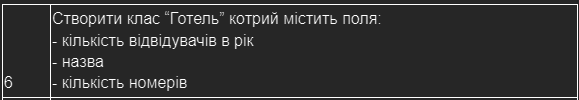

# The usniversity labs in Java language

## Tasks

### 1 Record introduction

- make Java console application `Hotel`  
- use `records`
- make static field and get method for it  
- make constructors and their chain  

